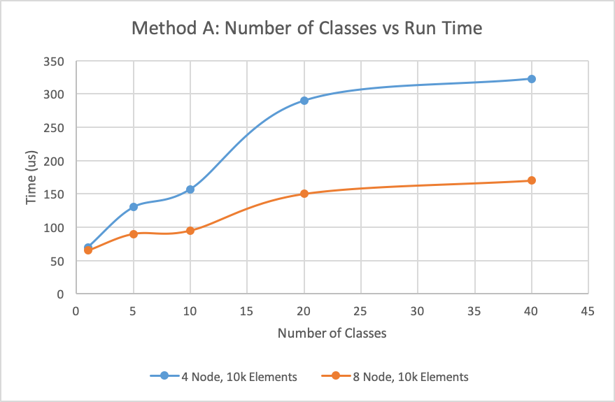
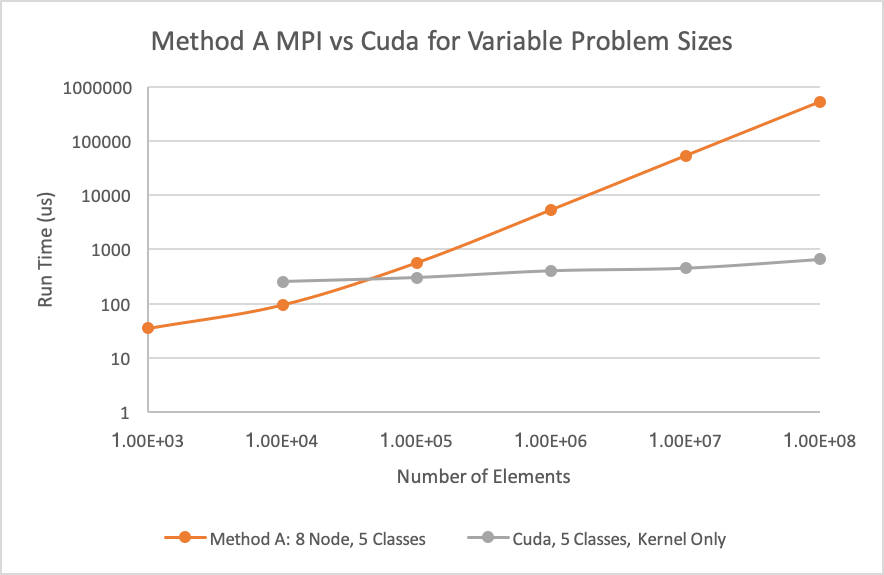
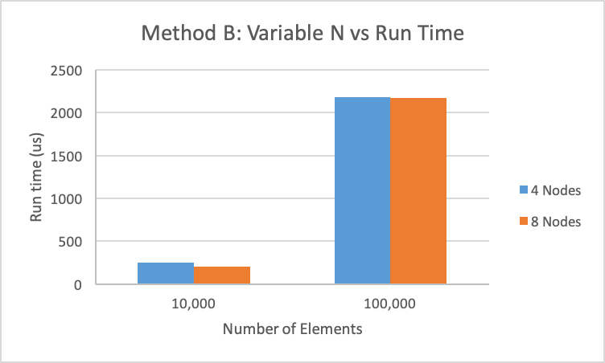
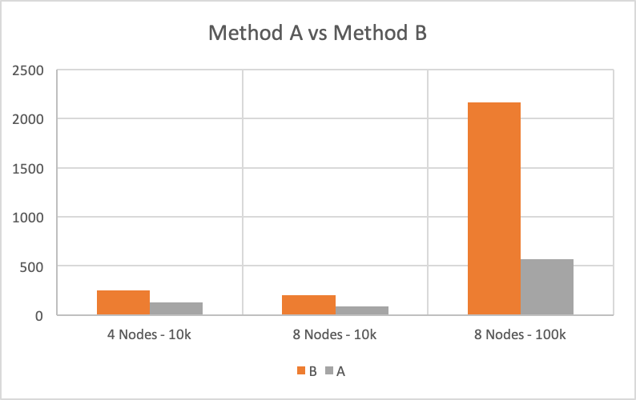
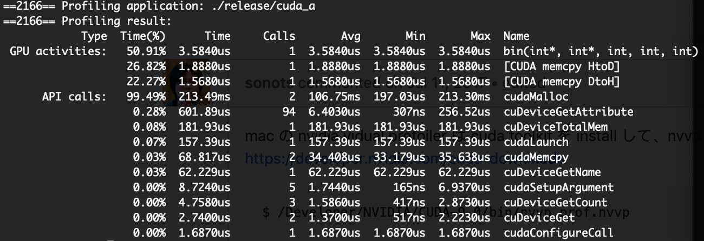
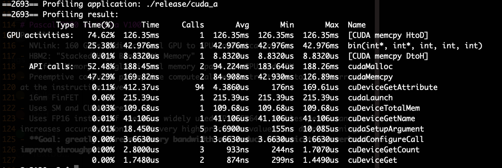

# Binning in MPI and Cuda

## Method A

### 4 Node Variable Clases
| Nodes | # Elements | # Classes | Time   |
|-------|------------|-----------|--------|
| 4     | 10,000     | 1         | 70 us  |
| 4     | 10,000     | 5         | 130 us |
| 4     | 10,000     | 10        | 157 us |
| 4     | 10,000     | 20        | 290 us |
| 4     | 10,000     | 40        | 323 us |

### 8 Node Variable Clases
| Nodes | # Elements | # Classes | Time   |
|-------|------------|-----------|--------|
| 8     | 10,000     | 1         | 65 us  |
| 8     | 10,000     | 5         | 90 us  |
| 8     | 10,000     | 10        | 95 us  |
| 8     | 10,000     | 20        | 150 us |
| 8     | 10,000     | 40        | 170 us |

### 8 Node Variable N 
| Nodes | # Elements | # Classes | Time       |
|-------|------------|-----------|------------|
| 8     | 1000       | 5         | 35 us      |
| 8     | 10,000     | 5         | 95 us      |
| 8     | 100,000    | 5         | 571 us     |
| 8     | 1,000,000  | 5         | 5399 us    |
| 8     | 10,000,000 | 5         | 53,570 us  |
| 8     | 100,000,000| 5         | 527,793 us |

## Method B
### 4 Node and 8 Node Variable N and 
| Nodes | # Elements | # Classes | Time   |
|-------|------------|-----------|--------|
| 4     | 10,000     | 5         | 249 us |
| 4     | 100,000    | 5         | 2179 us|
| 8     | 10,000     | 5         | 204 us |
| 8     | 100,000    | 5         | 2167 us|

## Cuda A - Variable N
| # Elements  | # Classes |  Run Time               |
|-------------|-----------|-------------------------|
| 10,000      | 5         |  252 us                 |
| 100,000     | 5         |  300 us                 |
| 1,000,000   | 5         |  400 us                 |
| 10,000,000  | 5         |  448 us                 |
| 100,000,000 | 5         |  651 us                 |

## Analysis
Effect of...

**Variable Classes:** 

Demonstrated by the variable classes experiment run with method A. 
Having more classes resulted in long run times. There are two likely explanations 
for this:
    1. With more classes, more comparisions must be made for each term to find 
    the correct bucket to place the value in
    2. With more buckets to place the term in, the memory access pattern becomes 
    evern more complicated than before. 

**Variable Problem Size:** 

Demonstrated by the **8 Node Variable N** test case run with method A.
With a larger N, the problem size grows and thus, we should expect the run time
to grow as well. We see this behavior clearly in the the timing results. Initially,
an increase in problem size by a factor of 10 led to a small increase in run time,
(less tha an equivocal 10x increase in time). This is likely because the underlying
hardware was being fully utilized in the smaller cases, thus increased problem sizes 
took advantage of idle hardware. However, the 10x jumps in problem size after 
100,000 elements resulted in similar 10x jumps in the timing 
data. 

**Method A vs. Method B**:

One of the most interesting questions to consider is how method A differs 
from the method B in timing. 

In method A, a fraction of the data is read and completely sorted by each process. 
The end results are coalesced on node 0 at the end of the run time. 
In comparision, each node in method B reads the entire data stream and only pulls
out nodes from a specific bucket type.

Our results show that method A is far superior to method B, in the 100k element 
case, running almost 4 times faster. This makes sense if we consider the how the
algorithm is running. In method A, every piece of data is touched only once by
any node before being sorted. Comparitively, in method B, each piece of data is
touched by EVERY SINGLE NODE.

**Method A vs. CUDA**

Another highly interesting question to consider is how well a CUDA implementation 
of binning performs against the algorithm discussed in method A. Intutively,
the operations performed to "bin" data" is very simple, simply determining where 
each piece of data falls within a set of buckets. We notice the run time remains 
fairly constant from problem size to problem size, while the run time from Method 
A increases linearly. 

The following two images show an interesting result. In the first image, we see
the profile data from a binning of 1000 elements. Here, we see the binning takes 
longer than the copy to the device. However as the problem size scales to 
100,000,000 elements, we see that suddenly the memcpy takes a longer time, indicating
that we've hit a memory bottleneck!

# Pascal P100 vs Volta V100
Pascal:
- NVLink: 160 GB/s bidirectional GPU to GPU communication
- HBM2: "Stacked High Bandwidth Memory"
- Unified Memory: single virtual memory space for CPU and GPU
- Preemptive compute: preemptive compute allows instructions to be interrupted
at the instruction level
- 16nm FinFET
- Uses SM and CUDA Cores
- Uses FP16 instead of the more widely used FP32/FP64 - doubles performance and
increases accuracy (don't want very high precision values for deep learning)
- **Goal: greatly increase memory bandwidth and reduce communication overheads to 
improve throughput**

V100:
- Introduction of Tensor Cores alongside CUDA Cores
- Targeted towards DL/ML
- Larger L1 Cache than the P100
- V100: unified shared memory/L1 cache
    - low cache hit latency
- Independent thread scheduling allows for in-warp synchronization
- **Tensor cores** offers multiply and add operations for greater efficiency
breaks away from the P100 focus on SM/CUDA cores
- improved unified memory
- improved HBM2 and NVLink performance
- **Goal: EXTREME performance on deep learning applications.**

# EC

